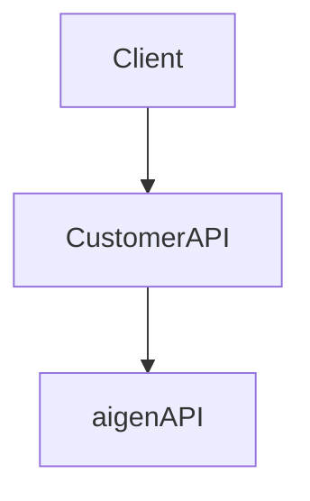

# aigen camera example

## 1. Face Compare

example of camera module for web platform integration

- Desktop implementaion
  https://github.com/b6db07d1a5/aigen-web-camera-excample/blob/main/camera_desktop.html

- Mobile implementation
  https://github.com/b6db07d1a5/aigen-web-camera-excample/blob/main/camera_mobile.html

## Usage

### Basic Example

```typescript
//base64 data for server side **due to security issue, please encrypt base64 with any secret
let image_data_url = canvas.toDataURL('image/jpeg').replace(/^data:image\/jpeg;base64,/, '')

//log base64
console.log(image_data_url)

// Post Image data to server
```

### Face Compare API

https://docs.aigen.online/documents/api-reference/aiface/face-compare

- Face Compare API does not support directly call from client, please call API from your own backend.



## 2. Face Liveness Detection

integration client for aigen-sdk.js.

## Packages

| Name            | Description                                                                                                                |
| --------------- | -------------------------------------------------------------------------------------------------------------------------- |
| [aigen-sdk](./) | [ ](https://www.npmjs.com/package/@b6db07d1a5/aigen-sdk) |

## Installation

```bash
npm install aigen-sdk
```

## Usage

### Basic Example

```typescript
import AIGEN from 'aigen-sdk'

const { FR } = new AIGEN()

await FR.startLivenessDetection({ camera, getSequence, postLiveness, faceTracing, sequenceCallback, finishCallback })
```

## Function

Face SDK function

| Function name            | Scenes                                                | Arguments to be passed to the listener                                                                                   |
| ------------------------ | ----------------------------------------------------- | ------------------------------------------------------------------------------------------------------------------------ |
| `startLivenessDetection` | The client start do process AI liveness verification. | camera: HTML video tag, getSequence: Func, postLiveness: Func, faceTracing: Func, sequenceCallback: Func, finishCallback |

## Callback parameters implementation

Require parameters

| Parameter name     | Scenes                                                      | Arguments to be passed to the callback |
| ------------------ | ----------------------------------------------------------- | -------------------------------------- |
| `camera`           | HTML video tag element (ready state) for camera capture.    | No argument                            |
| `getSequence`      | API connection to the server for get verification sequence. | No argument                            |
| `postLiveness`     | API connection to the server for process image.             | No argument                            |
| `faceTracing`      | Face tracing for tracking verify state.                     | (tracing: String)                      |
| `sequenceCallback` | Callback function when next sequence is ready to process.   | No argument                            |
| `finishCallback`   | Return data from aigen-sdk.                                 | (data: Object)                         |

### finishCallback object properties

```typescript
{
    "isAlive": Boolean,
    "attempt": Number,
    "face": "BASE64"
}
```

## Contact

https://aigencorp.com/en/contact-us/
